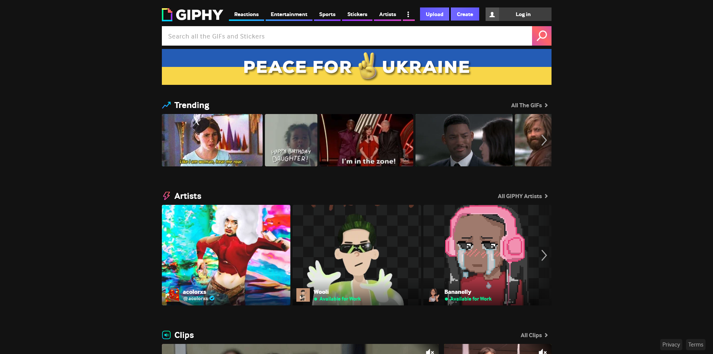
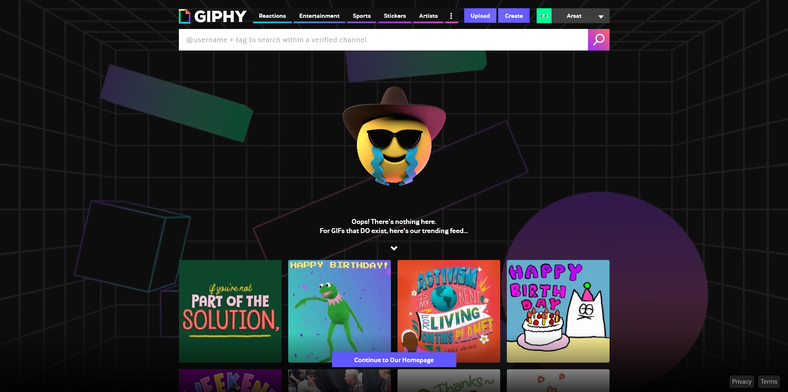

# GIPHY Clone
Giphy clone is an app made with NextJS and React. Its purpose is to be as similar as possible to giphy original app.

## Goals
Here is the home page and the 404 page goal at the start of the project:

## Technologies
For this project i want to improve my skills so i decide use the newest NextJS version which has changed its compiler from Babel to Rust, making it faster.

More about the practices and technologies that i used:
* Axios for http request
* ECS good practices
* NextJS v12
* Styled Components
* Environment Variables
* Several ways for data fetching: 
* * Server Side Rendering
* * Static Site Generation
* * Client Site Rendering
* * Dynamic Routing	
* * Incremental Static Regeneration.